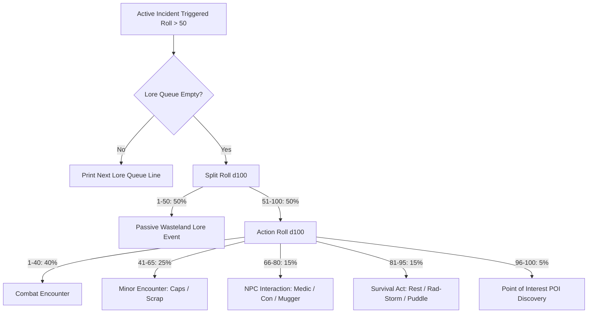

# ☢️ OVERLORD: OVERSEER FIELD MANUAL & GAMEPLAY GUIDE

> **DOCUMENT ID:** `VAULT-42-OFM-REV-3`  
> **CLEARANCE LEVEL:** OVERSEER EYES ONLY  
> **SYSTEM PROTOCOL:** RETRO-TERMINAL INTERFACE OS v3.13  

---

## 📑 TABLE OF CONTENTS
1. [Overview & Role of the Overseer](#1-overview--role-of-the-overseer)
2. [Bunker Infrastructure & Facilities](#2-bunker-infrastructure--facilities)
3. [The Expedition Simulation Engine](#3-the-expedition-simulation-engine)
4. [Master Encounter & RNG Tables](#4-master-encounter--rng-tables)
5. [Combat Mechanics & Emergency Triage](#5-combat-mechanics--emergency-triage)
6. [Points of Interest (POIs) & Breach Directives](#6-points-of-interest-pois--breach-directives)
7. [Psychological Trauma & The Sanity Engine](#7-psychological-trauma--the-sanity-engine)
8. [Equipment, Weaponry & Armor Databases](#8-equipment-weaponry--armor-databases)
9. [Loot Economy, Armory Stash & Requisition Market](#9-loot-economy-armory-stash--requisition-market)
10. [Personnel Roster, Recruitment & Death Protocol](#10-personnel-roster-recruitment--death-protocol)

---

## 1. OVERVIEW & ROLE OF THE OVERSEER

In **Overlord**, you assume control of **Vault Bunker 42** following total surface devastation. Your role as the Overseer is to ensure bunker continuity by:
* Dispatching brave or desperate wasteland scavengers into irradiated ruins.
* Monitoring live telemetry feeds, status vitals, and tactical logs in real-time.
* Intervening remotely when scavengers breach high-tier anomalous structures.
* Requisitioning advanced pre-war weaponry and protective ballistic gear.
* Synthesizing critical medical supplies in the Vault Engineering Bay.
* Managing inventory weight, stash constraints, and casualty triage.

The game runs in minute-by-minute simulation ticks (`processTicks`), accurately processing expedition progress in active foreground play and calculating cumulative offline elapsed time when resuming.

---

## 2. BUNKER INFRASTRUCTURE & FACILITIES

The Vault Command Center connects to four critical bunker decks:

```
[ COMMAND CENTER ]
       │
       ├─── [ ROOMS ] ────────> Vault Engineering & Medical Bay (Crafting)
       ├─── [ ROSTER ] ───────> Active Personnel & Recruitment Contracts Board
       ├─── [ STASH ] ────────> 50-Slot Armory & Salvage Liquidation Exchange
       └─── [ ACCESS MARKET ] ─> Requisition Store (Weapons, Armor, Medkits)
```

### The Medical Bay (`fac_medbay`)
* **Status at Start**: Offline / Destroyed.
* **Restoration Cost**: `10,000 Caps`.
* **Function**: Synthesizes 2x Wasteland Medkits from scavenged battlefield materials.
* **Synthesis Recipe**:
  - `1x` Used Syringe (`med_syringe`)
  - `2x` Irradiated Herbs (`med_herb`)
  - `1x` Expired Chemicals (`chem_expired`)
* **Distillation Cycle**: Exactly `240 minutes` (4 hours) real-time or offline simulation. Once complete, yields 2x Wasteland Medkits deposited directly into the Armory Stash.

---

## 3. THE EXPEDITION SIMULATION ENGINE

### Expedition States (`ScavState`)
Every scavenger in the roster operates in one of five discrete states:

| State | Color Code | Description |
|---|---|---|
| `idle` | Green (`#81C784`) | Resting inside Bunker 42. Slowly regenerates **+1 HP per minute**. |
| `exploring` | Terminal Green (`#69F0AE`) | In the wasteland ruins. Accumulates minutes, logs incidents, gathers loot. |
| `waitingForInput` | Alert Red (`#FF5252`) | Encountered a locked Point of Interest (POI). Requires Overseer directive. |
| `returning` | Orange Accent (`#FFAB40`) | Journeying back to Bunker 42 with collected backpack loot. |
| `dead` | Dark Blood Red (`#B71C1C`) | Vitals flatlined in combat or through toxic hazards. Awaiting extraction. |

### Return Travel Time Calculation
When a scavenger is recalled manually or their backpack fills up:
$$\text{Return Time (minutes)} = \left\lfloor \frac{\text{Minutes Explored}}{2} \right\rfloor$$
*Example: A scavenger who explored for 120 minutes takes 60 minutes to hike back to base.*

### Backpack & Stash Constraints
* **Backpack Capacity**: Strictly **10 inventory slots** (Caps are weightless).
* **Auto-Return Trigger**: As soon as a scavenger carries 10 non-cap items, they automatically abort their mission and head home:
  ```
  [SYSTEM] Backpack full! Automatically returning. ETA: 0H 45M.
  ```
* **Vault Stash Capacity**: Fixed at **50 items**. If the stash is completely full when a returning dweller reaches the vault blast doors, they wait outside until the Overseer clears space in the Armory.

---

## 4. MASTER ENCOUNTER & RNG TABLES

Every minute an active scavenger explores, a global d100 roll occurs:
* **Roll 1–50 (50%)**: Uneventful traversal / step progression.
* **Roll 51–100 (50%)**: Active incident triggered!

When an active incident triggers, the simulation checks the **Lore Queue** first:
* If the dweller has unread follow-up lines from a multi-line story, the next line is printed.
* If the Lore Queue is empty, a secondary d100 split roll occurs:



### Incident Probability Breakdown
1. **Passive Lore (50% of events)**: Over 30 environmental narratives including radio echoes, mutant sightings, and homage callbacks (*Fallout Vault 101/Mojave, S.T.A.L.K.E.R. Cheeki Breeki, Dark Souls bonfires, Resident Evil 4/Itchy/Tasty*).
2. **Combat Encounter (20% of events)**: Skirmishes with mutants, scrappers, raiders, or lethal drones.
3. **Minor Encounter (12.5% of events)**: 50% empty search, 45% loose caps (1–4 caps), 5% supply cache.
4. **NPC Interaction (7.5% of events)**:
   - *Caravan Doctor (30%)*: Offers medical treatment for 20 Caps (+50% Max HP).
   - *Neutral Wanderer (30%)*: Peaceful dialogue, no combat.
   - *Scam Artist (25%)*: Cheats the scavenger out of 15–34 Caps with fake maps or rigged games.
   - *Street Mugger (15%)*: Ambush skirmish inflicting 5–10 damage.
5. **Survival Events (7.5% of events)**:
   - *Campsite Rest (30%)*: Clean spring water or rest heals +10 HP.
   - *Neutral (30%)*: Duct-taping boots or waiting out rad-storms.
   - *Environmental Hazard (40%)*: Rad-scorpion stings, fungal spores, or contaminated puddle drinking (-10 to -20 HP).
6. **POI Discovery (2.5% of events)**: Finding a fortified wasteland structure.

---

## 5. COMBAT MECHANICS & EMERGENCY TRIAGE

Combat in Overlord is turn-based, simulated with realistic damage resistance, weapon damage spreads, and tactical ambush odds.

### Encounter Initiative & Pre-Combat Tactics
Before standard blows are traded, the tactical engine rolls for surprise:
* **0–19 (20%): Enemy Ambush!** The enemy attacks from behind, dealing **120% damage** minus armor DR before the dweller can react.
* **20–29 (10%): Stealth Ghost!** The dweller identifies the threat early and slips away undetected.
* **30–39 (10%): Player Ambush!** The dweller lands a crushing surprise strike dealing **150% weapon damage**. If lethal, the fight ends immediately with zero damage taken.
* **40–99 (60%): Standard Engagement.** Both combatants face off.

### The Combat Exchange Math
Standard combat executes a 2-round brawl:
1. **Round 1 (Dweller Attack)**:
   $$\text{Damage Dealt} = \text{Random}(\text{weapon.minStat}, \text{weapon.maxStat})$$
   If Enemy HP $\le 0$, dweller achieves a **Flawless Victory**!
2. **Enemy Counter-Attack**:
   $$\text{Damage Taken} = \max(0, \text{Random}(\text{enemy.minDamage}, \text{enemy.maxDamage}) - \text{armorDR})$$
   $$\text{Dweller HP} = \max(0, \text{Dweller HP} - \text{Damage Taken})$$
3. **Emergency Auto-Medkit Protocol**:
   If the dweller survives the strike but their HP falls to $\le 50\%$ Max HP:
   - If carrying a Wasteland Medkit (`c_medkit`), the dweller automatically injects it.
   - Restores $+50\%$ Max HP immediately (`min(maxHp, hp + maxHp / 2)`).
   - Deducts 1 Medkit from the backpack.
4. **Round 2 (Dweller Follow-up)**:
   If enemy is still alive, dweller strikes again. If enemy HP $\le 0$, dweller claims victory ("Messy Brawl"). If the enemy still stands, the dweller retreats to avoid death.

### Enemy Bestiary

| Category | Enemy Name | HP | Damage Range | Threat Level |
|---|---|---|---|---|
| **Tier 1: Pests** | Mutated Rat | 5 | 2 – 6 | Minimal. Easily dispatched bare-handed. |
| **Tier 1: Pests** | Feral Hound | 12 | 4 – 10 | Fast. Can wound unarmored scouts. |
| **Tier 2: Wastelanders** | Desperate Scrapper | 20 | 6 – 12 | Moderate. Swings heavy scrap metal. |
| **Tier 2: Wastelanders** | Raider Enforcer | 28 | 10 – 16 | High. Requires Tier 2 armor to mitigate. |
| **Tier 3: Lethal** | Feral Family (Ghouls) | 30 | 8 – 16 | Swarm tactics. Dangerous attrition. |
| **Tier 3: Lethal** | Security Drone | 45 | 15 – 22 | Armored pre-war tech. Deadly accurate. |
| **Tier 3: Lethal** | Featherless Turkey | 60 | 20 – 30 | Apex boss. Martial artist mutant bird. |

---

## 6. POINTS OF INTEREST (POIS) & BREACH DIRECTIVES

Points of Interest represent fortified locations containing high-grade pre-war salvage.

| Tier | Location Name | Hazard Profile | Flavor Profile |
|---|---|---|---|
| **Tier 1** | Abandoned Kindergarten | Low | Faded murals, rusted desks, picked-over salvage. |
| **Tier 1** | Rusted Gas Station | Low | Dry pumps, dusty convenience store shelves. |
| **Tier 2** | Collapsed Subway Tunnel | Moderate | Pitch black darkness, echoing water drips, subterranean mutants. |
| **Tier 3** | Ruined City Hospital | High | Overturned gurneys, emergency triage, medical supplies. |
| **Tier 4** | Abandoned Military Base (AMI) | Extreme | Heavily reinforced blast doors blown open from the inside. |

### The Overseer Breach Decision
When a dweller finds a POI in active play:
1. Exploration pauses. State changes to `waitingForInput`.
2. A pulsing red alert button appears on the Command Dashboard:
   `[ ACTION REQUIRED: ENCOUNTER DETECTED ]`
3. Opening the terminal displays the **Event Modal**:
   * **[ BREACH LOCATION ]**: Authorizes entry. The dweller attempts to force the locks:
     - Lockout Check: $15\% + (\text{POI Tier} \times 5\%)$ chance the entrance is permanently sealed.
     - Trap Check ($20\%$ chance): Triggering tripwires/pitfalls dealing $10\%$ Max HP damage.
     - Boss Check: Chance of confronting an apex Category 4 or Category 3 guardian.
     - Dynamic Loot Yield: High-tier weapon/armor drops, medical supplies, or large caches of Caps.
   * **[ SKIP / FALL BACK ]**: Scavenger logs the location as bypassed and safely resumes exploring the general wasteland.

*(Note: During offline progress, the simulation automatically resolves POI decisions using standard hazard odds.)*

---

## 7. PSYCHOLOGICAL TRAUMA & THE SANITY ENGINE

The wasteland breaks minds as readily as bones. Overlord features a hidden psychological trauma engine:

### Stress Accumulation
* Every **60 minutes** of wasteland exploration adds **+1 Stress** (clamped at 100).
* Prolonged expeditions past 24–48 hours push dwellers toward psychological breaking points.

### Hidden Psychological Afflictions
When recruiting from the Roster Board, candidates have a **25% chance** to carry a hidden mental affliction:

| Hidden Trait | Glitch Color | Behavioral Symptom & Effect |
|---|---|---|
| `ptsd` | Alert Red (`#FF5252`) | The terminal monitor flashes crimson. Combat logs trigger stress flashbacks. |
| `paranoid` | Toxic Violet (`#E040FB`) | When Stress $\ge 80$, the dweller **violently refuses all chemical/medkit injections**, crying sabotage! |
| `psychosis` | Warning Yellow (`#FFFF00`) | The terminal feed destabilizes: all system labels and logs corrupt into scrambled zalgo/cyber-glyph runes (`EngineHelpers.corruptText`). |

### The Hallucination Trigger & "Gaslight Reset"
* **The Russian Roulette Trigger**: When a dweller with a hidden trait exceeds 50 Stress, opening their dweller terminal triggers a **5% roll** to plunge the entire screen into hallucination mode.
* **The Gaslight Reset**: The exact millisecond you exit back to the Command Center, the visual evidence is erased and dweller stress is reset, leaving the Overseer wondering if the glitch was real.

---

## 8. EQUIPMENT, WEAPONRY & ARMOR DATABASES

### Weaponry

| Tier | Weapon Name | Base Damage | Market Value | Tactical Assessment |
|---|---|---|---|---|
| **Tier 1** | Heavy Duty Staple Gun | 3 – 6 | 75 Caps | Close range makeshift firearm. Good against vermin. |
| **Tier 1** | Rusted Rebar | 4 – 9 | 120 Caps | Heavy blunt weapon. Reliable kinetic force. |
| **Tier 2** | 9mm Pipe Pistol | 8 – 14 | 350 Caps | Crude firearm. Jams occasionally, but outranges melee. |
| **Tier 2** | Modified Nailgun | 10 – 18 | 450 Caps | High cyclic rate powered by heavy car batteries. |
| **Tier 3** | Pre-War Service Rifle | 20 – 35 | 1,500 Caps | Military-grade rifling. Deadly accurate at distance. |
| **Tier 3** | Plasma Torch | 30 – 50 | 2,500 Caps | Industrial bulk cutter that disintegrates organic targets. |

### Armor (Damage Reduction / DR)

| Tier | Armor Name | DR Block | Market Value | Tactical Assessment |
|---|---|---|---|---|
| **Tier 1** | Taped-Up Phonebooks | 2 – 6 | 80 Caps | Stops light blades. Heavy and useless when soaked. |
| **Tier 1** | Boiled Leather Apron | 4 – 10 | 150 Caps | Deflects glancing mutant bites and shrapnel. |
| **Tier 2** | Motorcycle Leathers | 8 – 14 | 400 Caps | Reinforced with tire chains and street signs. |
| **Tier 2** | Welded Scrap Plate | 12 – 18 | 600 Caps | Solid steel plates covering vital organs. Noisy but tough. |
| **Tier 3** | Pre-War Riot Suit | 18 – 22 | 1,800 Caps | Pristine composite body armor with glowing visor. |
| **Tier 3** | Scrap-Iron Power Frame | 25 – 35 | 3,000 Caps | Bulky powered rig making the wearer impervious to small arms. |

### The Auto-Equip Protocol
When a scavenger loots gear in the wasteland:
* If the corresponding weapon or armor slot is empty, they don it immediately.
* If the looted item is higher tier (or equal tier with superior average damage / DR), the dweller **swaps gear on the spot**, stashing their old equipment into their backpack.

---

## 9. LOOT ECONOMY, ARMORY STASH & REQUISITION MARKET

### Scavenged Materials & Scrap

| Item ID | Name | Type | Value | Stacks? | Use / Notes |
|---|---|---|---|---|---|
| `loot_caps` | Wasteland Caps | Currency | 1 Cap | Yes (Weightless) | Vault currency for recruits, armory, & medbay. |
| `c_medkit` | Wasteland Medkit | Consumable | 100 Caps | Yes | Restores 50% Max HP. Auto-injected in combat. |
| `f_dogfood` | Pre-War Dog Food | Food | 25 Caps | Yes | Rolls -20 to +30 HP (can heal or cause food poisoning!). |
| `med_syringe`| Used Syringe | Material | 5 Caps | Yes | Essential component for Medbay synthesis. |
| `med_herb` | Irradiated Herb | Material | 5 Caps | Yes | Essential component for Medbay synthesis. |
| `chem_expired`| Expired Chemicals | Material | 5 Caps | Yes | Essential component for Medbay synthesis. |

### Armory Stash Operations
* View items in the 50-slot vault armory via `[STASH]`.
* **Single Sell**: Liquidate individual units from stackable resources for quick capital.
* **Bulk Sell**: Liquidate full stacks or unique equipment instantly.
* **Transfer to Dweller**: Direct transfer from vault stash to individual dweller backpacks before deployment.

---

## 10. PERSONNEL ROSTER, RECRUITMENT & DEATH PROTOCOL

### Recruits Database

| Name | Base HP | Hiring Fee | Tactical Profile |
|---|---|---|---|
| **Jonny** | 100 HP | Starting Scout | Starter dweller equipped with staple gun & phonebooks. |
| **Shina** | 80 HP | 150 Caps | Agile scout. Low hit points but inexpensive to recruit. |
| **Drifter** | 100 HP | 300 Caps | Balanced veteran. Experienced in wasteland survival. |
| **Robot** | 150 HP | 600 Caps | Heavy mechanical chassis. High survivability tank. |

### Casualty Protocol (Caravan Trauma Care)
When a dweller's hit points reach zero, their signal goes dark (`ScavState.dead`):
* Permanent equipment and backpack items are **not lost**.
* The Overseer can dispatch a recovery caravan via `[ REVIVE SCAVENGER ]`.
* **Caravan Trauma Fee**: The caravan extracts **10% of Caps** found in the dweller's backpack (minimum 20 Caps).
* The dweller is revived at **25% Max HP**, clears active mental stress, and begins the return march back to Bunker 42.

---

*Manual compiled by Vault Bunker 42 Central Terminal.*  
*Stay vigilant. Trust the terminal. Keep the Vault running.*
